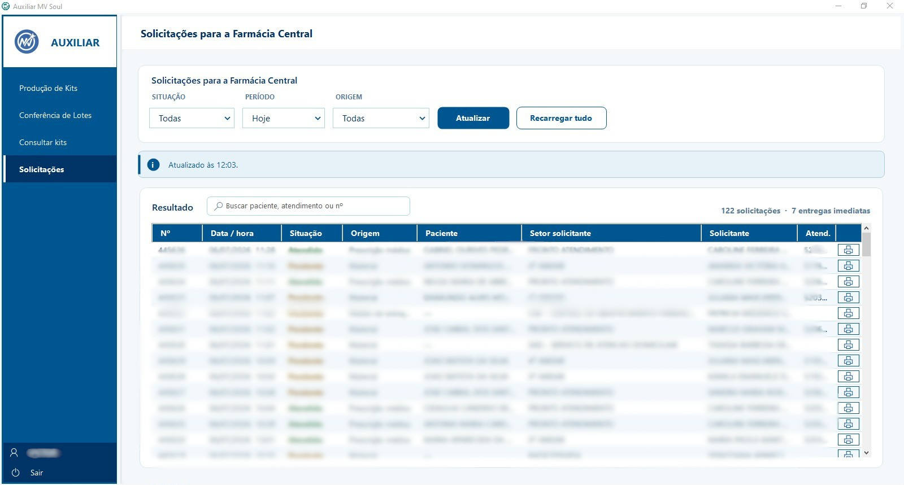

# Auxiliar MV Soul

Aplicação desktop que automatiza tarefas repetitivas da farmácia hospitalar dentro do ERP (SoulMV), sistema de grande porte usado em hospitais no Brasil. Rotinas que antes consumiam mais de uma hora dentro do sistema passaram a rodar em poucos cliques.

## Para que serve

Reúne em um app próprio os fluxos que a equipe fazia tela por tela no ERP: produção de kits, conferência de lotes, consulta de kits em estoque e acompanhamento (somente leitura) das solicitações que chegam à farmácia, com busca ao vivo por paciente, atendimento ou número.

## Como foi construído

O ERP não expõe API pública, então o protocolo foi mapeado a partir do próprio tráfego da aplicação e reescrito em C#. A comunicação combina autenticação CAS (HttpClient e CookieContainer), mensagens SOAP/XML contra o backend de forms, leitura dos relatórios direto do PDF (inflate de zlib e extração de texto por posição) e uma ponte com o agente de impressão local para enviar ZPL à Zebra.

A interface foi feita à mão em WinForms, com componentes próprios, tema e suporte a DPI. Tudo compila com o csc.exe do Windows, sem Visual Studio nem SDK, e gera um único executável nativo de cerca de 370 KB que roda em qualquer Windows sem runtime adicional.
