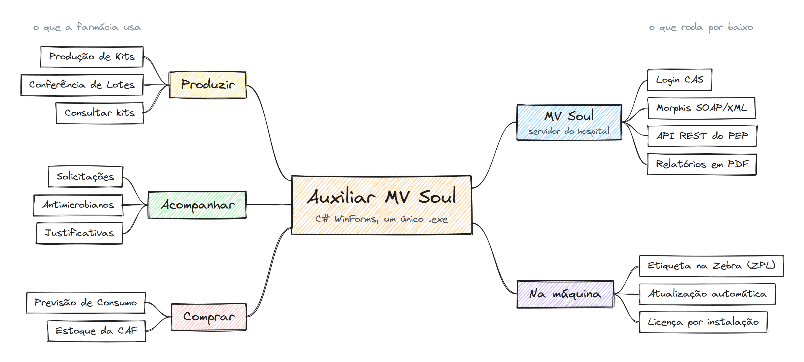
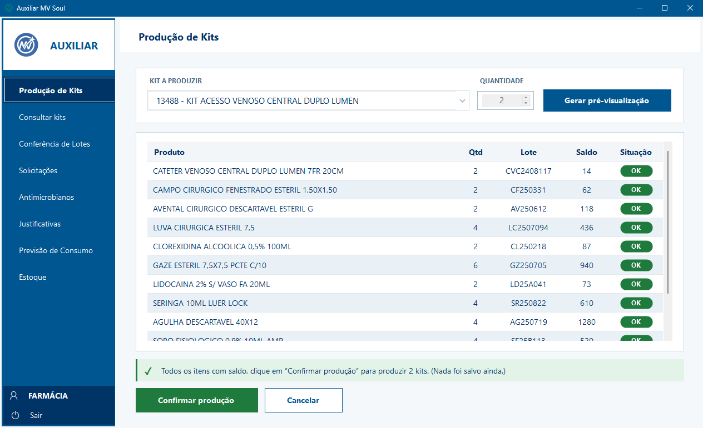
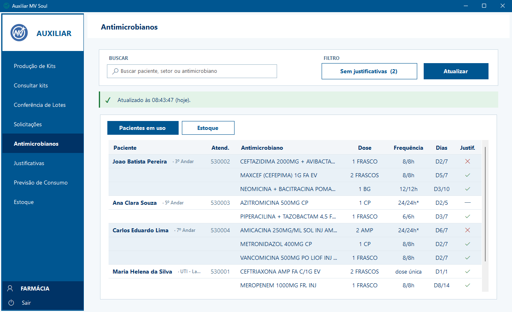
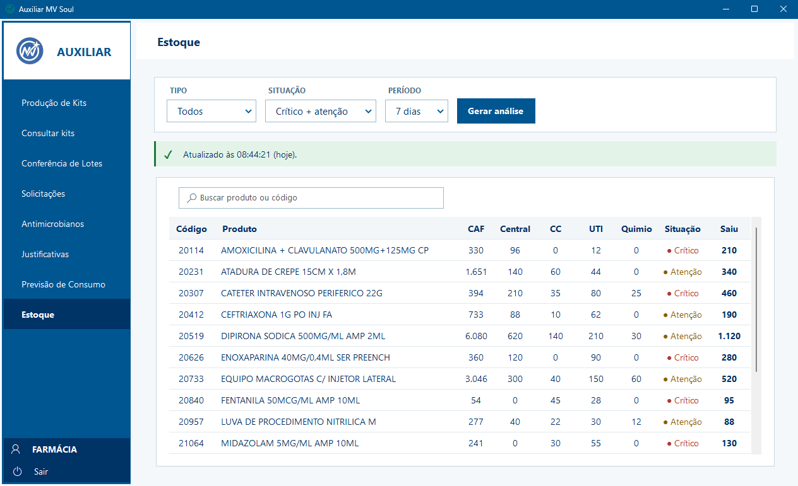

# Auxiliar MV Soul

App desktop que automatiza as rotinas repetitivas da farmácia hospitalar dentro do ERP MV Soul. O que levava mais de uma hora no sistema passa a levar poucos cliques.

Roda só na rede do hospital. As telas abaixo usam dados fictícios.

### Produção de Kits
Lote e saldo de cada item conferidos antes de gravar no MV.

### Antimicrobianos
Quem está em uso, em que dia do tratamento e se falta justificativa.

### Estoque
Saída da CAF contra o saldo dos setores, pronto para a compra.

